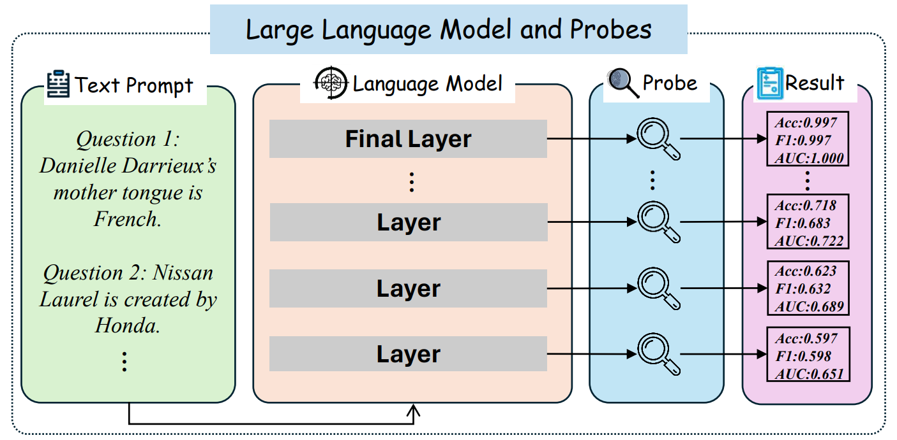
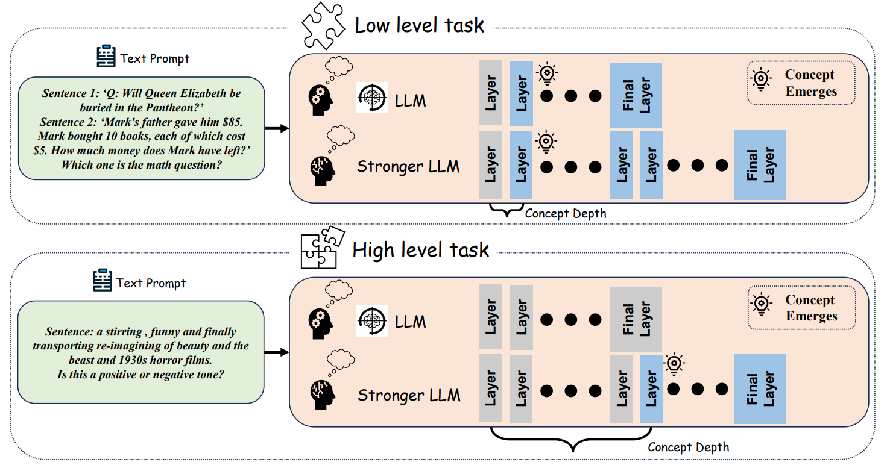

# Exploring Concept Depth: How Large Language Models Acquire Knowledge at Different Layers?

This repository presents the implementation of our work. We introduce **Concept Depth🔍** to measure where a concept is learned by LLMs with different sizes.

Paper Link: https://arxiv.org/abs/2404.07066 and https://aclanthology.org/2025.coling-main.37/, Accepted By **COLING 2025**

Project Website: https://luckfort.github.io/explore_CD

<div align=center></div>

This novel concept is used to analyze the comprehension ability of Large Language Models (LLM) and the difficulty of a concept's understanding. We use probing techniques🔍 on each layer's embedding to detect the layer accuracy, F1-score, and AUC of the classification task.

## Key Discoveries💡

- LLMs tend to effectively categorize simple (low-level) tasks, indicating that these concepts are learned in the first few initial layers. 

- Difficult (High-level) tasks may only be recognizable (if at all) in deeper layers, and LLMs of the same size perform largely consistently across datasets in terms of concept depth. 

<div align=center></div>
<!--This paper proposes the Concept Depth, the phenomenon that different concepts are learned in different layers of large language models, i.e. more difficult concepts are fully acquired with deeper layers. -->


## Requirements✨
```
pip install -r requirements.txt
```

## Dataset📕

We apply nine datasets to evaluate **Concept Depth**. 

**Raw Files**
```
See: ./dataset
``` 
**Dataset Size**

Here shows the data samples we use to train the LLMs in each dataset.

|  Dataset     | Number of Samples |
| ------------ | --------- |
|  StrategyQA  |   2290    |
|  Coinflip    |    500    |
|  Cities      |   1496    |
|  CommonClaim |   6000    |
|  Counterfact |   4000    |
|  HateEval    |   6000    |
|  STSA        |   6920    |
|  IMDb        |   2000    |
|  Sarcasm     |   6000    |

## Run the Code💻

Note: if your huggingface token is not ready, please try the code below:
```
from huggingface_hub import notebook_login
notebook_login()
```

**Run by Jupyter**
Please open run.ipynb for jupyter environment.

**Run by One-click**
```
python run.py
``` 

**Run by Instructions**
```
python3 main.py --model $MODEL --quant QUANT --noise NOISE --dataset $DATASET
```

**Run Anchoring Experiments by Instructions**
```
python3 main_anchor.py --dataset $DATASET
```

\$MODEL: Model name. 

\$DATASET: Dataset name. 

QUANT: The number of bits for quantization. Could be 8, 16, and 32.

NOISE: Replace NOISE with "non-noise" or "noise". "non-noise" for no noise perturbation. "noise" for noise perturbation. Please remove the quotation marks when replacing.


Feel free to change these 4 variables.
For example: If we want to train Gemma-2B over dataset STSA, the instruction is:
```
python3 main.py --model google/gemma-2b --dataset STSA
```
If we want to train Gemma-2B over dataset STSA, using 16 bit quantization, the instruction is:
```
python3 main.py --model google/gemma-2b --dataset STSA --quant 16 
```

If we want to train Gemma-2B over dataset STSA with noise perturbation, the instruction is:
```
python3 main.py --model google/gemma-2b --dataset STSA --noise noise
```

For anchoring experiment, if we want to try dataset STSA, the instruction is:
```
python3 main_anchor.py --dataset STSA
```

Other cases could be found here.
|  Model name  |                 $MODEL             |
| ------------ | ---------------------------------- |
|  Gemma-2B    |  google/gemma-2b                   |
|  Gemma-7B    |  google/gemma-7b                   |
|  LLaMA-7B    |  meta-llama/Llama-2-7b-chat-hf     |
|  LLaMA-13B   |  meta-llama/Llama-2-13b-chat-hf    |
|  QWen-0.5B   |  Qwen/Qwen1.5-0.5B                 |
|  QWen-1.8B   |  Qwen/Qwen1.5-1.8B                 |
|  QWen-4B     |  Qwen/Qwen1.5-4B                   |
|  QWen-7B     |  Qwen/Qwen1.5-7B                   |
|  QWen-14B    |  Qwen/Qwen1.5-14B                  |


|  Dataset     | $DATASET     |
| ------------ | ------------ |
|  StrategyQA  |  StrategyQA  |
|  Coinflip    |  coinflip    |
|  Cities      |  cities      |
|  CommonClaim |  common      |
|  Counterfact |  counterfact |
|  HateEval    |  hateeval    |
|  STSA        |  STSA        |
|  IMDb        |  IMDb        |
|  Sarcasm     |  sarcasm     |

## Citation
Please cite the following paper corresponding to the repository:
```
@inproceedings{jin-etal-2025-exploring,
    title = "Exploring Concept Depth: How Large Language Models Acquire Knowledge and Concept at Different Layers?",
    author = "Jin, Mingyu  and Yu, Qinkai  and
      Huang, Jingyuan  and
      Zeng, Qingcheng  and
      Wang, Zhenting  and
      Hua, Wenyue  and
      Zhao, Haiyan  and
      Mei, Kai  and
      Meng, Yanda  and
      Ding, Kaize  and
      Yang, Fan  and
      Du, Mengnan  and
      Zhang, Yongfeng",
    booktitle = "Proceedings of the 31st International Conference on Computational Linguistics",
    month = jan,
    year = "2025",
    address = "Abu Dhabi, UAE",
    publisher = "Association for Computational Linguistics",
    url = "https://aclanthology.org/2025.coling-main.37/",
    pages = "558--573",
}
@article{jin2024exploring,
  title={Exploring Concept Depth: How Large Language Models Acquire Knowledge at Different Layers?},
  author={Jin, Mingyu and Yu, Qinkai and Huang, Jingyuan and Zeng, Qingcheng and Wang, Zhenting and Hua, Wenyue and Zhao, Haiyan and Mei, Kai and Meng, Yanda and Ding, Kaize and others},
  journal={arXiv preprint arXiv:2404.07066},
  year={2024}
}

```
